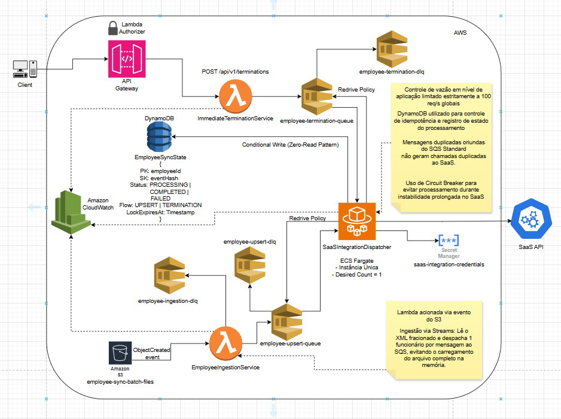

# Arquitetura da Solução - Boticário Sync Hub

## Diagrama de Arquitetura



> O diagrama acima representa a arquitetura de referência da solução.
> Todas as decisões descritas neste documento devem ser interpretadas em conjunto com o desenho arquitetural.

---

# 1. Objetivo

O Boticário Sync Hub é uma plataforma de integração responsável por sincronizar dados de colaboradores entre um ERP interno e uma plataforma SaaS através de API REST.

A solução foi projetada para suportar dois fluxos com características distintas:

- Inclusões e alterações processadas em lote (Batch).
- Demissões processadas em fluxo imediato (Near Real-Time).

O principal desafio da solução é garantir a entrega confiável dos eventos respeitando o limite máximo de 100 requisições por segundo imposto pelo SaaS, mantendo rastreabilidade, resiliência e simplicidade operacional.

---

# 2. Premissas e Simplificações do Desafio

As seguintes simplificações foram adotadas por se tratar de uma Prova de Conceito (PoC):

- Os dados de colaboradores são fictícios.
- O ERP é representado por arquivos XML simulados.
- O SaaS é representado por uma API simulada.
- O Dashboard utiliza dados mockados e não realiza chamadas para o backend.
- Não será implementado mecanismo real de autenticação entre ERP e plataforma.
- A infraestrutura AWS será representada por código de infraestrutura sem necessidade de provisionamento real.
- O foco principal da solução está nos mecanismos de priorização, controle de vazão, resiliência e idempotência.

---

# 3. Componentes AWS

A arquitetura utiliza os seguintes serviços:

- Amazon S3
- AWS Lambda
- Amazon API Gateway
- Amazon SQS
- Amazon ECS Fargate
- Amazon DynamoDB
- AWS Secrets Manager
- Amazon CloudWatch

---

# 4. Fluxos de Negócio

A solução possui dois fluxos independentes que convergem para uma camada única de despacho responsável pela integração com o SaaS.

## Fluxo Batch

Responsável por processar inclusões e alterações de colaboradores.

Características:

- Execução diária.
- Aproximadamente 30.000 registros.
- Processamento assíncrono.
- Menor prioridade.

---

## Fluxo Imediato

Responsável por processar desligamentos.

Características:

- Near Real-Time.
- Processamento prioritário.
- Menor latência possível.
- Prioridade absoluta sobre o fluxo batch.

---

# 5. Fluxo Batch - Inclusões e Alterações

## Ingestão

O ERP realiza o upload diário de um arquivo XML para o bucket:

```text
employee-sync-batch-files
```

A criação do arquivo dispara automaticamente a execução da Lambda:

```text
EmployeeIngestionService
```

através do evento:

```text
S3 ObjectCreated Event
```

---

## Processamento do XML

Para evitar consumo excessivo de memória, o XML deve ser processado via **streaming SAX (evented)** com a biblioteca `saxes`, consumindo incrementalmente o `Body` (`Readable`) retornado pelo S3.

O arquivo não deve ser carregado integralmente em memória. **Não** se utiliza `fast-xml-parser` nesta etapa, pois ele desserializa o documento inteiro em memória (não é SAX/stream).

Cada colaborador encontrado no XML é transformado em um evento individual e publicado na fila:

```text
employee-upsert-queue
```

A publicação é feita **em lotes** (via `sendMessageBatch`), drenando um buffer pequeno de eventos a cada N colaboradores — uma ida à fila por lote em vez de uma por colaborador. Isso reduz em ~10× o número de chamadas para ~30.000 registros (de ~30k para ~3k), sem aumentar a memória: o buffer é limitado (O(1)). O tamanho do lote no processador é um limite de memória; o teto técnico por chamada (SQS = 10) fica encapsulado no provider de fila.

Essa estratégia elimina riscos de Out Of Memory mesmo para lotes contendo dezenas de milhares de registros.

---

## Tratamento de Falhas

Caso ocorra falha durante o processamento do arquivo:

- XML inválido.
- XML malformado.
- Erro inesperado de processamento.

O evento original deverá ser direcionado para:

```text
employee-ingestion-dlq
```

permitindo reprocessamento posterior.

---

# 6. Fluxo Imediato - Demissões

## Endpoint

O ERP envia desligamentos através do endpoint:

```http
POST /api/v1/terminations
```

---

## Ingestão

A requisição é recebida pelo Amazon API Gateway e encaminhada para a Lambda:

```text
ImmediateTerminationService
```

---

## Validação

A Lambda valida o payload recebido.

Após validação bem-sucedida, o evento é publicado na fila prioritária:

```text
employee-termination-queue
```

---

# 7. Modelo de Eventos

## Evento de Inclusão ou Alteração

```json
{
  "employeeId": "12345",
  "eventType": "UPSERT",
  "eventTimestamp": "2025-01-01T10:00:00Z",
  "data": {
    "name": "João Silva",
    "department": "Technology",
    "position": "Software Engineer"
  }
}
```

---

## Evento de Demissão

```json
{
  "employeeId": "12345",
  "eventType": "TERMINATION",
  "eventTimestamp": "2025-01-01T10:00:00Z"
}
```

---

# 8. Dispatcher e Controle de Vazão

Toda comunicação com o SaaS é realizada exclusivamente pelo componente:

```text
SaaSIntegrationDispatcher
```

executando em:

```text
Amazon ECS Fargate
Desired Count = 1
```

A utilização de uma única instância é uma decisão arquitetural intencional para centralizar o controle global de vazão.

## Prioridade de Consumo

O Dispatcher deve seguir a seguinte estratégia:

1. Consumir mensagens da fila `employee-termination-queue`.
2. Enquanto existirem mensagens pendentes nessa fila, nenhum evento batch poderá ser processado.
3. Somente quando a fila prioritária estiver vazia o consumo da fila `employee-upsert-queue` poderá ocorrer.

Essa abordagem garante prioridade absoluta para desligamentos.

---

## Controle de Vazão

Toda comunicação com o SaaS deve respeitar o limite global de:

```text
100 requisições por segundo
```

O controle é realizado internamente na aplicação utilizando:

```text
Bottleneck
```

Não devem existir múltiplos consumidores compartilhando esse limite.

---

## Concorrência e Vazão (Instância Única)

Instância única **não** significa processamento serial. O dispatcher processa cada lote do SQS de forma **concorrente** (`Promise.allSettled`), explorando a concorrência de I/O do Node: várias requisições ao SaaS ficam em voo ao mesmo tempo, dentro do **mesmo** processo e do **mesmo** limitador `Bottleneck`.

- O `Bottleneck` (`minTime` derivado de `SAAS_RATE_LIMIT_PER_SECOND`) garante o teto de 100 req/s **independentemente da concorrência** — a concorrência não fura o limite, apenas permite *alcançá-lo* apesar da latência do parceiro.
- Serial, a vazão seria ≈ `1 / latência`; com o lote concorrente ela tende ao teto do rate limit. A concorrência necessária para saturar o limite segue a Lei de Little: `rate_limit × latência` (ex.: 100 req/s × 100 ms = 10 em voo).
- `Promise.allSettled` isola a falha de cada mensagem do lote: uma rejeição inesperada (ex.: erro de DynamoDB) não derruba as mensagens irmãs nem o loop do worker.

> Hoje o lote concorrente é limitado a `MAX_MESSAGES` (10) por ciclo — suficiente para saturar 100 req/s em latências de até ~100 ms. Latências maiores demandariam *pipelining* (mais de um lote em voo), registrado como evolução futura.

# 9. Estado Operacional e Idempotência

A solução utiliza uma única tabela DynamoDB chamada:

```text
EmployeeSyncState
```

Essa tabela possui duas responsabilidades:

1. Garantir idempotência dos eventos enviados ao SaaS.
2. Registrar o estado operacional do processamento para rastreabilidade.

---

## Estrutura da Tabela

### Partition Key

```text
employeeId
```

### Sort Key

```text
eventHash
```

---

## Atributos

### employeeId

Identificador único do colaborador.

### eventHash

Hash SHA-256 gerado a partir do payload normalizado do evento.

Eventos com payloads diferentes gerarão hashes diferentes.

### flow

Tipo do fluxo processado.

Valores possíveis:

```text
UPSERT
TERMINATION
```

### status

Estado atual do processamento.

Valores possíveis:

```text
PROCESSING
COMPLETED
FAILED
```

### lockExpiresAt

Timestamp utilizado para recuperação automática de eventos órfãos.

Não possui relação com TTL do DynamoDB.

Sua finalidade é controlar o tempo máximo permitido para um evento permanecer em processamento.

### createdAt

Data de criação do registro.

### updatedAt

Data da última atualização do registro.

---

## Exemplo de Registro

```json
{
  "employeeId": "12345",
  "eventHash": "8a9d6c7f...",
  "flow": "UPSERT",
  "status": "PROCESSING",
  "lockExpiresAt": "2025-01-01T10:04:00Z",
  "createdAt": "2025-01-01T10:00:00Z",
  "updatedAt": "2025-01-01T10:00:00Z"
}
```

---

# 10. Estratégia de Idempotência

A solução adota o padrão:

```text
Zero-Read Pattern
```

O Dispatcher não realiza consultas prévias ao DynamoDB para verificar a existência do evento.

Toda validação de duplicidade ocorre através de operações condicionais.

O objetivo é reduzir latência e evitar leituras desnecessárias em cenários de alta volumetria.

---

## Motivação

Como a solução utiliza SQS Standard, mensagens duplicadas podem ocorrer naturalmente.

Além disso, eventos podem ser reenviados devido a:

- Falhas temporárias.
- Timeouts de rede.
- Reprocessamentos automáticos.
- Retentativas do SQS.

A estratégia de idempotência garante que o mesmo evento não seja enviado ao SaaS mais de uma vez.

---

# 11. Fluxo de Processamento

## Primeira Execução

Quando o Dispatcher recebe uma mensagem:

```text
employeeId=12345
eventHash=ABC123
```

ele tenta registrar o evento no DynamoDB utilizando uma operação condicional.

Caso o evento não exista, o registro é criado com:

```text
Status = PROCESSING
```

e:

```text
LockExpiresAt = agora + PROCESSING_LOCK_TIMEOUT_SECONDS
```

Após o registro bem-sucedido, o Dispatcher realiza a chamada para o SaaS.

---

## Sucesso

Se o SaaS responder com sucesso:

```text
2xx
```

o registro é atualizado para:

```text
Status = COMPLETED
```

e a mensagem é removida da fila.

---

## Falha Temporária

Se ocorrer erro temporário:

```text
5xx
```

ou timeout de comunicação:

```text
Timeout
```

o `SaaSIntegrationDispatcher` aplica primeiro **retentativa interna com backoff exponencial + jitter** (até `SAAS_MAX_RETRY_ATTEMPTS` tentativas). Persistindo a falha, o registro é atualizado para:

```text
Status = FAILED
```

e a mensagem retorna para a fila através do mecanismo padrão do SQS (redrive por Visibility Timeout), até eventual envio à DLQ.

---

# 12. Reprocessamento

Quando uma mensagem retorna para processamento, o Dispatcher avalia o estado existente.

---

## Evento COMPLETED

```text
Status = COMPLETED
```

Significa que o evento já foi enviado com sucesso ao SaaS.

Nesse cenário:

```text
Não processar novamente
```

A mensagem deve ser descartada.

---

## Evento FAILED

```text
Status = FAILED
```

Significa que houve falha anterior.

Nesse cenário:

```text
Permitir reprocessamento
```

O Dispatcher pode assumir novamente o controle do evento.

---

## Evento PROCESSING

Quando o evento está em:

```text
Status = PROCESSING
```

o Dispatcher deve avaliar o campo:

```text
lockExpiresAt
```

---

### Lock Ainda Válido

Se:

```text
agora < lockExpiresAt
```

o evento ainda está sendo processado por outro consumidor.

Nesse cenário:

```text
Bloquear processamento
```

---

### Lock Expirado

Se:

```text
agora >= lockExpiresAt
```

o evento é considerado órfão.

Nesse cenário:

```text
Permitir recuperação
```

O Dispatcher pode assumir novamente o processamento.

---

# 13. Recuperação de Eventos Órfãos

O campo:

```text
lockExpiresAt
```

foi introduzido para tratar cenários de falha distribuída.

Exemplo:

```text
Mensagem recebida
↓
Registro PROCESSING criado
↓
SaaS processa com sucesso
↓
Falha de rede
↓
Container interrompido
↓
Mensagem retorna para fila
```

Sem mecanismo de recuperação, o evento permaneceria indefinidamente em:

```text
PROCESSING
```

impedindo novas tentativas.

O LockExpiresAt permite que eventos abandonados sejam recuperados automaticamente.

---

## Configuração

Valor padrão:

```env
PROCESSING_LOCK_TIMEOUT_SECONDS=240
```

---

## Observação

O campo:

```text
lockExpiresAt
```

não deve ser utilizado como mecanismo de retenção ou expiração de dados.

Seu objetivo é exclusivamente controlar a posse temporária do processamento.

---

# 14. Compatibilidade com SQS

O valor de:

```env
PROCESSING_LOCK_TIMEOUT_SECONDS
```

deve ser configurado em conjunto com:

- Visibility Timeout
- Max Receive Count

A recomendação é:

```text
PROCESSING_LOCK_TIMEOUT_SECONDS <
(SQS_VISIBILITY_TIMEOUT_SECONDS × MAX_RECEIVE_COUNT)
```

Isso garante que eventos presos em estado PROCESSING possam ser recuperados antes do envio para a DLQ.

---

# 15. Circuit Breaker

O SaaS apresenta instabilidades frequentes.

Para proteger tanto a plataforma parceira quanto as filas SQS, o Dispatcher implementa o padrão:

```text
Circuit Breaker
```

---

## Estados

### Closed

Operação normal.

Mensagens são consumidas normalmente.

### Open

Falhas consecutivas acima do limite configurado.

O Dispatcher interrompe completamente o polling das filas.

Nenhuma mensagem é consumida.

### Half-Open

Após o período de recuperação, o circuito admite **uma única tentativa de sonda** (*single-trial*): apenas a primeira requisição passa; as demais de um lote concorrente são barradas até a sonda resolver.

Se a sonda for bem-sucedida:

```text
Half-Open → Closed
```

Caso contrário:

```text
Half-Open → Open
```

Admitir uma só sonda evita que, num lote concorrente, dezenas de requisições atinjam de uma vez um parceiro recém-recuperado (*thundering herd*).

---

## Comportamento

O `SaaSIntegrationDispatcher` avalia o estado do Circuit Breaker no início de cada iteração do seu loop, **antes** de realizar qualquer chamada de polling ao SQS.

 Quando o circuito estiver no estado **Open**:
- O Worker suspende temporariamente o polling de ambas as filas (`employee-termination-queue` e `employee-upsert-queue`) aplicando um sleep assíncrono nativo.
- Nenhuma nova chamada de rede é gerada para o SaaS.

Essa abordagem preserva o limite de tentativas do SQS e evita o envio desnecessário de mensagens para a DLQ.

---

## Tratamento de Mensagens em Voo

Caso o circuito mude para o estado **Open** enquanto um lote de mensagens já tiver sido extraído e estiver em processamento ativo na memória (*in-flight*):
- As requisições pendentes desse lote para o SaaS serão imediatamente bloqueadas pelo Circuit Breaker.
- A aplicação rejeitará a mensagem no código sem confirmar o recebimento (sem enviar o ACK), fazendo com que ela retorne nativamente para a fila após a expiração do *Visibility Timeout*.
- Isso garante que a instabilidade repentina do parceiro não queime de forma injusta o contador de tentativas (`maxReceiveCount`) das mensagens que já estavam no meio do caminho.

---

## Sonda Única no Half-Open (Single-Trial)

Como o lote é processado de forma **concorrente** (§8), a recuperação do circuito usa **single-trial**: no estado Half-Open, o gate consumível do Circuit Breaker (`tryProceed`) admite **uma** sonda; as demais requisições do lote recebem `CircuitOpenError` e retornam à fila sem ACK.

A sonda é consumida no momento do **envio real** ao SaaS (em `SaaSHttpClient`), **não** na aquisição do lock de idempotência. Essa escolha evita "gastar" a sonda — e travar o circuito — caso o evento curto-circuite por idempotência (`ALREADY_COMPLETED` / `LOCK_ACTIVE`) sem chegar a chamar o parceiro.

Como consequência, as mensagens **não-sonda** do lote podem adquirir um **lock transitório** (`PROCESSING`) antes de serem barradas. Esse lock é recuperado pelo mesmo mecanismo de `lockExpiresAt` (§13): o efeito é limitado ao lote em recuperação e auto-recuperável.

## Política de Retentativa em Camadas

O requisito de "retentativa inteligente (ex.: Exponential Backoff)" é atendido por uma estratégia em camadas, da mais barata à mais drástica:

1. **Backoff exponencial com jitter (in-process)** — o `SaaSIntegrationDispatcher` retenta falhas transitórias (`5xx` / timeout) até `SAAS_MAX_RETRY_ATTEMPTS` vezes, aguardando `SAAS_BACKOFF_BASE_MS × 2^(n-1)` + jitter entre as tentativas. Absorve instabilidades curtas sem devolver a mensagem à fila.
2. **Circuit Breaker** — para instabilidade sustentada. Com o circuito `Open`, nenhuma nova tentativa é feita (sem backoff): o polling é suspenso e mensagens em voo retornam à fila sem ACK. Evita tempestade de retentativas contra um parceiro já indisponível.
3. **SQS redrive (Visibility Timeout)** — esgotado o backoff in-process, a mensagem volta à fila nativamente para nova tentativa futura.
4. **Dead Letter Queue** — após `maxReceiveCount`, a mensagem é isolada na DLQ do fluxo para análise.

O backoff in-process é deliberadamente curto (poucas tentativas) para não exceder o `lockExpiresAt` nem reter o slot global de vazão.

---

# 16. Integração com o SaaS

Toda comunicação externa deve ocorrer exclusivamente através do componente:

```text
SaaSIntegrationDispatcher
```

Nenhuma Lambda deve realizar chamadas diretas ao SaaS.

Essa decisão centraliza:

- Controle de vazão.
- Resiliência.
- Idempotência.
- Observabilidade.
- Gerenciamento de credenciais.

---

## Credenciais

As credenciais do SaaS devem ser armazenadas no:

```text
AWS Secrets Manager
```

utilizando o secret:

```text
saas-integration-credentials
```

---

## Estrutura Esperada

```json
{
  "baseUrl": "https://api.partner.com",
  "apiKey": "xxxxx"
}
```

---

## Cache Local

Para evitar chamadas excessivas ao Secrets Manager, o Dispatcher deve manter as credenciais em memória.

O cache deve possuir TTL configurável.

Exemplo:

```env
SECRETS_CACHE_TTL_SECONDS=300
```

Quando o TTL expirar, as credenciais devem ser carregadas novamente.

---

# 17. Estratégia de Filas

A solução utiliza:

```text
Amazon SQS Standard
```

---

## Justificativa

O desafio não exige processamento ordenado.

Além disso:

- SQS Standard possui maior throughput.
- Menor custo.
- Maior simplicidade operacional.

---

## Duplicação de Mensagens

Mensagens duplicadas podem ocorrer naturalmente.

Esse comportamento é esperado.

A prevenção de chamadas duplicadas ao SaaS é garantida através da estratégia de idempotência implementada no DynamoDB.

---

# 18. Dead Letter Queues

Cada fluxo possui sua própria fila de erro.

---

## Ingestão Batch

Fila principal:

```text
employee-upsert-queue
```

DLQ:

```text
employee-upsert-dlq
```

---

## Demissões

Fila principal:

```text
employee-termination-queue
```

DLQ:

```text
employee-termination-dlq
```

---

## Ingestão de Arquivos

Evento principal:

```text
S3 ObjectCreated
```

DLQ:

```text
employee-ingestion-dlq
```

---

## Configuração

Valor recomendado:

```text
maxReceiveCount = 5
```

Após atingir o limite de tentativas, a mensagem será encaminhada para a respectiva DLQ.

---

# 19. Observabilidade

Toda tentativa de envio ao SaaS deve gerar logs estruturados.

---

## Campos Obrigatórios

```json
{
  "timestamp": "2025-01-01T10:00:00Z",
  "employeeId": "12345",
  "flow": "UPSERT",
  "status": "SUCCESS"
}
```

---

## Logs de Erro

```json
{
  "timestamp": "2025-01-01T10:00:00Z",
  "employeeId": "12345",
  "flow": "TERMINATION",
  "status": "ERROR",
  "error": "Partner API timeout"
}
```

---

## Destino

Todos os logs devem ser enviados para:

```text
Amazon CloudWatch Logs
```

---

# 20. Métricas

A solução deve expor métricas operacionais relevantes.

---

## Métricas Recomendadas

### Volume de Envios

```text
saas_requests_total
```

---

### Sucessos

```text
saas_requests_success
```

---

### Falhas

```text
saas_requests_failed
```

---

### Eventos Processados

```text
employees_processed_total
```

---

### Eventos Rejeitados por Idempotência

```text
idempotency_rejections_total
```

---

### Circuit Breaker

```text
circuit_breaker_open_total
```

---

## Emissão (EMF)

As métricas são emitidas pelo `SaaSIntegrationDispatcher` no formato **EMF (Embedded Metric Format)**: cada evento de métrica é um log JSON com o envelope `_aws` escrito no **stdout**. O driver `awslogs` do ECS Fargate entrega esse log ao **CloudWatch Logs**, que **extrai a métrica automaticamente** — sem `PutMetricData`, sem permissão IAM adicional e sem coletor externo.

É um modelo **push** (a aplicação publica e segue) com **extração** feita pelo CloudWatch. **Não é scraping/raspagem** — este seria o modelo *pull* (ex.: Prometheus fazendo *polling* de um endpoint `/metrics`).

As métricas são publicadas no namespace:

```text
BoticarioSyncHub
```

Esse namespace é um **contrato com a infraestrutura**: precisa ser idêntico ao `local.metrics_namespace` (`infra/locals.tf`), pois os alarmes (§21) consultam as métricas exatamente nele. A taxa de falha do SaaS, por exemplo, é derivada via *metric math* de `saas_requests_failed / saas_requests_total`.

> `saas_requests_total` e `saas_requests_failed` são contados por **tentativa real** (após a guarda do Circuit Breaker), mantendo a razão da taxa de falha consistente.

---

# 21. Alarmes

CloudWatch Alarms devem ser configurados para monitorar:

---

## Mensagens em DLQ

- employee-ingestion-dlq
- employee-upsert-dlq
- employee-termination-dlq

---

## Circuit Breaker Aberto

Quantidade excessiva de aberturas do circuito.

---

## Falhas no SaaS

Aumento anormal da taxa de erros.

---

# 22. Segurança

## Princípio do Menor Privilégio

Cada componente deve possuir apenas as permissões necessárias para sua execução.

---

## Lambda de Ingestão

Permissões mínimas:

- Leitura do bucket S3.
- Escrita na fila SQS.

---

## Lambda de Demissões

Permissões mínimas:

- Escrita na fila SQS.

---

## Dispatcher

Permissões mínimas:

- Consumo das filas SQS.
- Leitura do Secrets Manager.
- Escrita no DynamoDB.
- Escrita de logs no CloudWatch.

---

# 23. Considerações de Custos

A arquitetura prioriza baixo custo operacional.

---

## Lambda

Adequada para cargas esporádicas.

O custo tende a zero quando não há processamento.

---

## ECS Fargate

Uma única tarefa permanente reduz complexidade arquitetural.

A estratégia elimina a necessidade de:

- Redis.
- Controle distribuído de rate limit.
- Coordenação entre múltiplos consumidores.

---

## DynamoDB

Adequado para cenários de alta escrita e baixa necessidade de consultas complexas.

---

# 24. Decisões Arquiteturais Principais

## ADR-001

Utilizar AWS Lambda para ingestão dos eventos.

Motivação:

- Escalabilidade automática.
- Baixo custo.
- Simplicidade operacional.

---

## ADR-002

Utilizar ECS Fargate para integração com o SaaS.

Motivação:

- Controle previsível do Event Loop.
- Controle centralizado de vazão.
- Facilidade para implementação de Circuit Breaker.

---

## ADR-003

Utilizar Bottleneck para controle de rate limit.

Motivação:

- Implementação simples.
- Controle preciso de 100 req/s.
- Dispensa infraestrutura adicional.

---

## ADR-004

Utilizar DynamoDB para Estado Operacional e Idempotência.

Motivação:

- Alta capacidade de escrita.
- Baixa latência.
- Suporte a operações condicionais.
- Implementação do padrão Zero-Read.

---

## ADR-005

Utilizar SQS Standard.

Motivação:

- Alto throughput.
- Menor custo.
- Ordenação não é requisito do negócio.

Duplicações são tratadas pela camada de idempotência.

---

## Trade-offs e Evoluções

As decisões com custo consciente (o que foi escolhido de propósito, o que se abriu mão em troca, e o gatilho/caminho de cada evolução futura) estão registradas em [`TRADEOFFS.md`](./TRADEOFFS.md).

---

# 25. Execução Local e Estratégia de Mocks

Conforme as premissas do desafio (§2), a solução deve rodar localmente **sem AWS real, LocalStack ou Docker complexo**, usando Mocks/Stubs. A arquitetura de DI por interfaces torna isso direto: troca-se apenas a camada de Providers concretos por implementações in-memory, preservando 100% da lógica de negócio.

## Acionamento

```text
npm run start:local
```

Executa `src/workers/dispatcher/main.local.ts` (entrypoint fino), que chama `runLocalDemo()` (`src/workers/dispatcher/demo/`). A orquestração monta, via `makeLocalDispatcherWorker()`, o **mesmo** `DispatcherService` / `DispatcherWorker` de produção com Providers in-memory, e roda uma sequência de cenários narrados. Um `ManualClock` compartilhado pelo Circuit Breaker e pelo `sleep` do worker torna a abertura/recuperação do circuito determinística e instantânea.

## Substituições

| Componente real | Substituto local | Função na demo |
|---|---|---|
| Amazon SQS (`SqsQueueProvider`) | `InMemoryQueueProvider` | Filas em memória pré-carregadas com eventos de exemplo (termination + upsert) |
| Secrets Manager (`SecretsManagerProvider`) | `InMemorySecretProvider` | Credenciais fixas de demonstração |
| API do SaaS (`fetch` → parceiro) | `SaaSHttpClient` real + `createStubSaaSFetch` (fetch stubado 2xx/5xx/latência) | Não substitui o cliente: injeta um `fetch` determinístico no `SaaSHttpClient` de produção, exercitando backoff, rate limit e a abertura/recuperação do Circuit Breaker (Open → Half-Open → Closed) de forma real e determinística (relógio manual) |
| DynamoDB (`DynamoSyncStateRepository`) | `InMemorySyncStateRepository` | Estado e idempotência via `Map` em memória |

A demo (`runLocalDemo`) evidencia, sem nuvem, em cenários narrados sequenciais:

1. **Priorização + retry/backoff** — demissões antes de upserts; falha transitória que recupera.
2. **Volume + rate limit** — lote de 30 upserts cadenciado a 100 req/s (sem 429).
3. **Falha definitiva → DLQ** — esgotamento de retries e redrive para a DLQ.
4. **Circuit Breaker** — 5 falhas consecutivas abrem o circuito; após o reset, half-open → closed.
5. **Idempotência (Zero-Read)** — reenvio do mesmo evento descartado (`ALREADY_COMPLETED`).

Ao final, imprime um **resumo consolidado** (Sucessos / Erros / Retentativas / Idempotência) no formato dos totalizadores do dashboard.

---

# 26. Resumo da Solução

A arquitetura proposta garante:

- Processamento de aproximadamente 30.000 colaboradores por lote.
- Priorização absoluta de demissões.
- Respeito ao limite de 100 requisições por segundo do SaaS.
- Resiliência através de Circuit Breaker e retentativas.
- Idempotência baseada em Zero-Read Pattern.
- Recuperação automática de eventos órfãos através de LockExpiresAt.
- Rastreabilidade completa através de logs estruturados.
- Simplicidade operacional com baixo custo de infraestrutura.

A solução foi projetada para demonstrar boas práticas de arquitetura distribuída, observabilidade, resiliência e integração em ambientes cloud utilizando serviços gerenciados da AWS.
